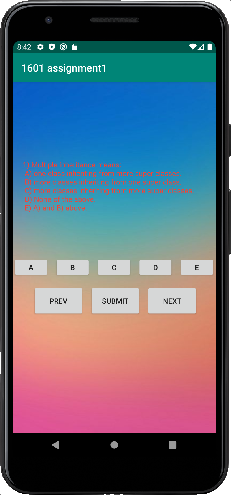

# Android Quiz Application:
    There are 10 questions with only one intended answer for this app.
    When you click next, the programme will save your answer.
    If you did not choose a solution, it will be considered as wrong automatically
    When you click submit, it will calculate your mark and launch a pop up window
## Here is what it looks like when you firstly launch the programme

